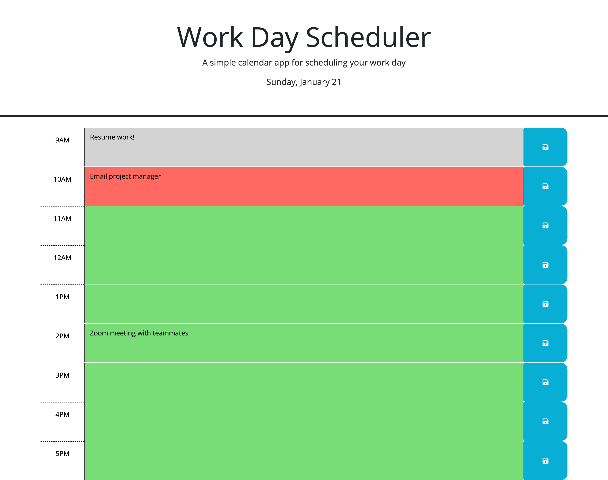

# rasDevs-Challenge5-Workday-Scheduler

## Description

This calendar application that allows a user to save events for each hour of a typical working day (9am&ndash;5pm). This application feature dynamically updated HTML and CSS powered by jQuery.

## User Story

AS AN employee with a busy schedule
I WANT to add important events to a daily planner
SO THAT I can manage my time effectively

## Acceptance Criteria

GIVEN I am using a daily planner to create a schedule
WHEN I open the planner
THEN the current day is displayed at the top of the calendar
WHEN I scroll down
THEN I am presented with timeblocks for standard business hours of 9am&ndash;5pm
WHEN I view the timeblocks for that day
THEN each timeblock is color coded to indicate whether it is in the past, present, or future
WHEN I click into a timeblock
THEN I can enter an event
WHEN I click the save button for that timeblock
THEN the text for that event is saved in local storage
WHEN I refresh the page
THEN the saved events persist

## License

MIT License - The License file is provided here : (./LICENSE)

## Screenshot

## Deployed Page and GitHub Repository

Deployed Webpage : https://rasdevworld.github.io/rasDevs-Challenge5-Workday-Scheduler/

Github Repository: https://github.com/rasdevworld/rasDevs-Challenge5-Workday-Scheduler